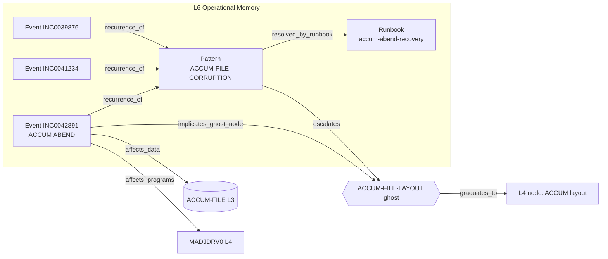
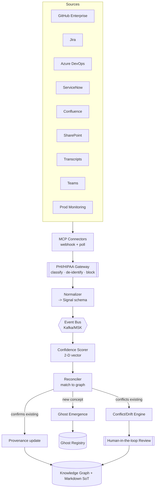
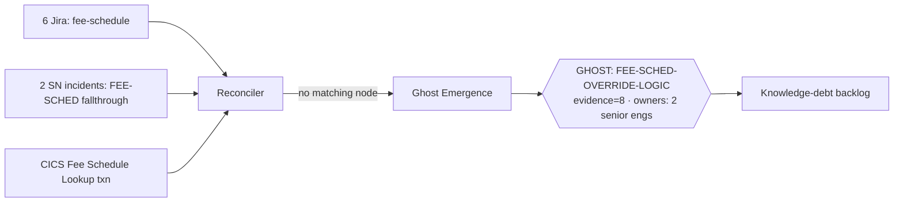
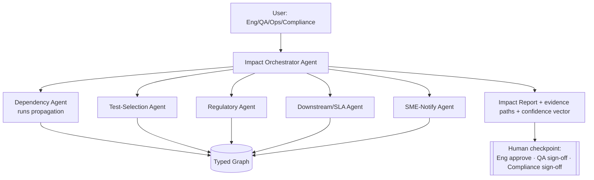
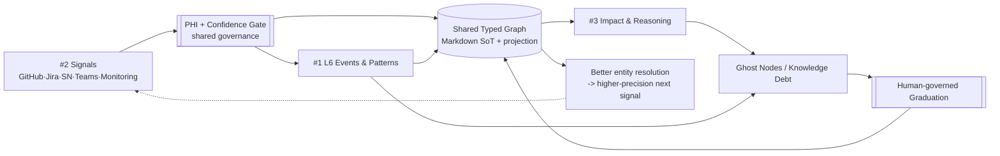

# Mivan Digital Brain — Next-Generation Architecture

*Design proposal for review. Status: DRAFT (to-be). Date: 2026-08-10.*

*Companion: `docs/brain-overview.md` is the as-is state; this document is the target state that closes the divergences catalogued there (§9/§10).*

**Epistemic legend (this document obeys the platform's own discipline).** Every material factual or quantitative claim is tagged `[grounded: <source>]` (verifiable in the repo today) or `[assumption]` (a stated design premise, not a Mivan fact). Genuine unknowns are registered as **proposed ghost nodes** rather than invented. No dollar figures appear anywhere — we have no grounded financial data.

**Framing.** This is not an optimization of the current Digital Brain. It is the next version. But it is built *from* the primitives that already exist, because most of what an operational platform needs is already present in embryonic form and the fastest credible path is to grow those primitives, not replace them. Where a current element cannot scale to an enterprise health plan, it is named for elimination in the final section.

**What already exists, at a glance** `[grounded: repo]`:
- Layered estate L1–L6 + MEM with provenance frontmatter (`fidelity`, `validated_by`, `links_back/forward`, `ghost_node_id`).
- Ghost-node registry with a `GHOST → IN-FLIGHT → COMPLETE` lifecycle. Current: **26 nodes / 7 COMPLETE / 1 IN-FLIGHT / 18 GHOST** `[grounded: ghost-nodes.md]`.
- OBSERVABLE vs INFERRED discipline + `fidelity` (HIGH/PARTIAL/DRAFT) — a confidence primitive.
- MEM capture → curate → validate → graduate pipeline (`/contributions/save`, curate mode).
- Routing map with Q01–Q10 question classes, incl. **Q04 Impact Assessment** `[grounded: routing-map.md]`.
- Portal **Blast Radius** view + **Skill 8 (COBOL Knowledge Extractor)** with implicit-dependency + migration-risk modeling `[grounded: cobol-knowledge-extractor.md]`.
- Mock connectors (GitHub/ServiceNow/Confluence) with a **`/connectors/servicenow/knowledge-gaps`** endpoint that already correlates incidents to ghost nodes; Jira is `not_configured` `[grounded: backend/connectors, app.py]`.

**Scale targets designed against** (none are Mivan-supplied) `[assumption]`: ~4M commercial claims/day at peak is grounded `[grounded: L3 §1]`; beyond that I assume O(10⁶) members, O(10³) applications/services, O(10⁴–10⁵) knowledge nodes at maturity, ingestion in the O(10⁴–10⁶) signals/day range, and an interactive impact-query latency target of <5s p95 / <60s for deep multi-hop. These drive the "what won't scale" conclusions.

**The urgency that anchors all three enhancements** `[grounded: L3 §7a]`: the single largest concentration of critical tribal knowledge — adjudication core, DRG grouper, undocumented VSAM layouts — sits with one SME (James Whitfield, 28 years) **retiring in 2027**. The platform's job is to convert that person-dependent knowledge into graph-resident, continuously-validated knowledge before it walks out the door. That is a knowledge-*capture-under-deadline* problem, which is why L6 (capture from operations) comes first.

---

## ENHANCEMENT #1 — Task Intelligence (L6)

### Executive summary
Today L6 holds training agendas, not operational intelligence, and two of its intended contents are already registered ghost nodes (`L6-TASK-INTELLIGENCE`, `HISTORICAL-DEFECT-PATTERNS`) `[grounded: ghost-nodes.md]`. This redesign makes L6 the platform's **operational memory**: a typed, graph-linked record of every incident, defect, outage, complaint, test/QA-escape failure, deployment failure, SME intervention, change request, and audit finding — each linked back to the L3/L4/L5 systems, programs, and rules it touched, and forward to the ghost nodes it reveals. L6 is not a data lake copy of ServiceNow; it is the *distilled, causally-linked* layer that turns raw events into reusable operational knowledge and, critically, into **knowledge-debt signals** (§2).

### Why this matters
- **The retirement cliff.** Every ACCUM-FILE ABEND that James resolves by hand `[grounded: INC0042891, PRB0004521]` is knowledge that currently lives only in his head and a free-text ServiceNow resolution field. L6 captures the *resolution pattern* as structured knowledge before 2027.
- **Recurrence is invisible today.** The mock data already shows a problem record clustering three ACCUM-FILE corruption incidents over six months `[grounded: PRB0004521]`. Without L6, that pattern is only visible because a human opened a PRB. L6 makes recurrence a first-class, queryable object.

### Role divergence (only where they differ)
- **CIO:** wants L6 as audit-defensible proof that operational risk (esp. single-SME dependency) is being actively retired.
- **Chief Architect:** wants L6 as *typed edges into the existing graph*, not a parallel store — no second source of truth.
- **AMS Lead:** wants L6 to shorten MTTR by surfacing "last time this ABEND happened, here's the fix."
- **Product Owner:** wants the incident→ghost-node→graduation loop measurable as a funnel.

### What already exists (ground)
`/connectors/servicenow/knowledge-gaps` already returns incidents where `related_ghost_node` is set and `knowledge_extracted:false` `[grounded: servicenow_connector.py]`. The mock incidents already carry `programs_involved`, `tables_involved`, `related_ghost_node`, `tags`, `root_cause`, `resolution` `[grounded: servicenow_data.json]`. L6 formalizes and persists what that endpoint gestures at.

### Data model

**Folder structure** (L6 becomes event-typed, not document-typed):

```
knowledge/L6-task-intelligence/
  README.md
  taxonomy.md                     # controlled vocabularies (event_type, subsystem, resolution_pattern)
  events/                         # one node per operational event, sharded by year-month
    2026-08/
      INC0042891-accum-abend.md
      CHG0018234-drg-fy2027.md
  patterns/                       # distilled recurring patterns (graduated from N events)
    ACCUM-FILE-CORRUPTION-PATTERN.md
    FEED-SLA-BREACH-PATTERN.md
  runbooks/                       # procedural knowledge, linked from patterns
    accum-file-abend-recovery.md
  playbooks/                      # multi-step operational responses (composite)
```

Rationale: **events** are immutable observations; **patterns** are the learned abstraction over ≥N events; **runbooks/playbooks** are the actionable output. This mirrors the existing MEM `contributions → graduated node` distinction, so it reuses the graduation lifecycle rather than inventing one.

**Markdown schema — an L6 event node** (frontmatter designed to be a superset of the existing convention, so the same validators work):

```yaml
---
layer: L6
node_type: ops-event              # ops-event | ops-pattern | runbook | playbook
event_type: incident              # incident|outage|claims-defect|provider-complaint|
                                  #   test-failure|qa-escape|deploy-failure|sme-intervention|
                                  #   change-request|audit-finding
source_system: servicenow
source_ref: INC0042891            # system-of-record id (never the authority — see #2)
domain: claims
severity: P1
occurred_at: 2026-08-05T02:14:00Z
resolved_at: 2026-08-05T04:47:00Z
mttr_minutes: 153
# --- graph edges (the reason L6 is powerful) ---
affects_programs: [MADJDRV0, MACCUML0, MACCUPD0]     # -> L4
affects_data: [ACCUM-FILE, CLAIM_HEADER]             # -> L3/L4
affects_rules: []                                    # -> L5
implicates_ghost_node: ACCUM-FILE-LAYOUT             # -> ghost registry
resolution_pattern: idcams-repro-restart-from-checkpoint
sme_intervention_by: james.whitfield                # single-SME risk flag
recurrence_of: PRB0004521                            # -> pattern node
# --- confidence (see #2 two-dimension vector) ---
source_trust: high                 # production incident record
fidelity: PARTIAL                  # root cause OBSERVABLE; permanent fix INFERRED
validated_by: "Digital Brain — pending SME review"
links_back: [knowledge/L4-application/micps-application-knowledge.md]
links_forward: [knowledge/ghost-nodes.md]
---
```

**Graph relationships** (the taxonomy of edges L6 introduces):

| Edge | From → To | Meaning |
|---|---|---|
| `affects_programs` | L6 event → L4 program | operational reality touching an app node |
| `affects_data` | L6 event → L3/L4 file/table | data object implicated |
| `affects_rules` | L6 event → L5 rule | business rule implicated |
| `implicates_ghost_node` | L6 event → ghost node | this event is *evidence of* a known gap |
| `recurrence_of` | L6 event → L6 pattern | Nth occurrence of a pattern |
| `sme_intervention_by` | L6 event → person | concentration-risk signal |
| `resolved_by_runbook` | L6 event → L6 runbook | closes the loop: pattern → reusable fix |



### Learning lifecycle
1. **Ingest** an event (from #2) → create an immutable L6 event node with edges resolved against the existing graph.
2. **Correlate** — if ≥N events share `resolution_pattern` + `affects_data`/`affects_programs`, auto-propose an `ops-pattern` node (this is the PRB0004521 behavior, automated).
3. **Escalate** — a pattern that implicates a ghost node raises that ghost's priority/evidence count (feeds #2's knowledge-debt scoring).
4. **Distill** — SME/agent authors a runbook from the pattern; runbook graduates like any MEM contribution.
5. **Close the loop** — future matching events auto-link to the runbook, and MTTR is measured before/after.

### Operational dashboards `[assumption on exact widgets]`
- **Knowledge-debt heatmap** — ghost nodes sized by count of implicating L6 events (ACCUM-FILE-LAYOUT would dominate today `[grounded: 1 INC + 1 PRB clustering 3 INCs]`).
- **Single-SME exposure** — events/patterns whose only resolver is one person; James's 2027 clock overlaid.
- **Recurrence radar** — patterns trending up.
- **MTTR-by-pattern** — before/after runbook graduation.

### AI use cases
- Auto-draft an L6 event node from a raw ServiceNow resolution field, marking OBSERVABLE (what ABENDed, when) vs INFERRED (why it will/won't recur).
- Cluster free-text incidents into candidate patterns.
- Draft a runbook from a pattern + the linked L4/L3 nodes.

### Agent use cases
- **Ops Memory Agent:** on a new P1, retrieves the matching pattern + runbook and posts "seen 3× since Feb; here's the checkpoint-restart procedure" before a human triages.
- **Debt Escalation Agent:** nightly, recomputes ghost-node evidence counts and re-prioritizes the registry.

### Value to healthcare AMS orgs
Turns AMS from ticket-closing into knowledge-compounding: each incident permanently reduces the cost of the next one and measurably retires single-SME risk.

### Sample workflow (Mivan, grounded)
INC0042891 (ACCUM-FILE S0C7 ABEND, batch-window breach, resolved by James via IDCAMS REPRO) `[grounded]` → L6 event created, `implicates_ghost_node: ACCUM-FILE-LAYOUT`, `sme_intervention_by: james.whitfield` → correlation with INC0041234/INC0039876 auto-forms `ACCUM-FILE-CORRUPTION-PATTERN` `[grounded: PRB0004521 lists these three]` → pattern escalates `ACCUM-FILE-LAYOUT` and cites the Wave-2 accumulator→DynamoDB driver `[grounded: L3 §7c]`.

### Risks
- **Copying ServiceNow instead of distilling it** → mitigation: L6 stores *distilled, linked* nodes, not raw tickets; raw stays in the source system (referenced by `source_ref`).
- **PHI in resolution text** (member IDs appear in incident descriptions `[grounded: INC0042891 "member MBR-77823"]`) → mitigation: de-identify on ingest (see #2 PHI layer).
- **Pattern false-positives** → mitigation: patterns are proposals requiring one human confirmation before they drive escalation.

### KPI / falsifiability
- **Value hypothesis:** *Structured, linked L6 memory reduces repeat-incident MTTR.*
- **Confirming/disproving metric:** median MTTR for the *second-and-later* occurrence of a recognized pattern vs the first. If it doesn't fall after runbook graduation, the hypothesis is wrong.

### How this surpasses RAG
RAG retrieves the text of past tickets. L6 retrieves the **causal graph**: which program, which VSAM file, which ghost node, how many recurrences, which runbook, which SME — and can *act* on it (escalate a ghost, trigger a runbook). RAG can't tell you "this is the 4th time and here's the fix that worked," because it has no typed recurrence edge.

### Eliminates/replaces
Replaces the current L6 (training agendas) as the *definition* of the layer; agendas move to a `training/` subfolder and stop being mistaken for operational intelligence.

---

## ENHANCEMENT #2 — Live Knowledge Ingestion

### Executive summary
Today ingestion is mock-mode connectors with Jira `not_configured` `[grounded: app.py /connectors/status]`. This redesign is an **event-driven ingestion plane** across GitHub Enterprise, Jira, Azure DevOps, ServiceNow, Confluence, SharePoint, meeting transcripts, Teams, and production monitoring — normalizing every source into typed **signals**, scoring each on a **two-dimension confidence vector** (source-trust × epistemic-fidelity, kept explicitly orthogonal), reconciling them against the graph, and — the headline capability — **auto-emerging ghost nodes** when signals reference a concept the estate does not yet cover. A mandatory PHI/HIPAA governance layer sits in front of everything.

### Why this matters
The Brain is only as current as its last manual edit. In an estate changing via thousands of PRs, tickets, and alerts, static docs are stale on arrival. But naive ingestion of Teams/transcripts into a claims knowledge base is a PHI incident waiting to happen — so governance is the enabling constraint, not an afterthought.

### Role divergence
- **CIO:** the first question is "does this put PHI somewhere it shouldn't be?" — governance gates funding.
- **Architect:** wants one normalized signal schema and idempotent, replayable ingestion.
- **AMS Lead:** wants production alerts to update the Brain in minutes, not at the next doc review.
- **Product Owner:** wants auto-emerged ghost nodes as a measurable "knowledge debt" backlog.

### What already exists (ground)
Connector modules return typed JSON and one — ServiceNow — already computes knowledge gaps from `related_ghost_node` + `knowledge_extracted` `[grounded]`. The move is: (a) flip mock→live via MCP, (b) make it event-driven, (c) generalize `/knowledge-gaps` into cross-source auto-emergence.

### Ingestion architecture



**Event-driven updates:** webhooks where available (GitHub, Jira, ADO, ServiceNow, monitoring), polling fallback for the rest; each becomes an immutable, replayable event on the bus (idempotency key = `source_system + source_ref + content_hash`).

**Normalized Signal schema** (every source collapses to this):

```yaml
signal_id: sha256(...)
source_system: servicenow | github | jira | ado | confluence | sharepoint | teams | transcript | monitoring
source_ref: INC0042512
content_hash: <sha256 of de-identified payload>
observed_at: 2026-07-15T14:00:00Z
concept_refs: [COB, PAYER_COB_AGREE, MCOBPYR0, MSP]   # extracted entities -> graph candidates
proposed_layer: L5
phi_class: de-identified            # raw-blocked | de-identified | phi-free
source_trust: high                  # DIMENSION 1 (see below)
epistemic_fidelity:                 # DIMENSION 2
  mode: OBSERVABLE                  # OBSERVABLE | INFERRED
  level: HIGH                       # HIGH | PARTIAL | DRAFT
```

### Confidence: two orthogonal dimensions (the requested model)
Source-trust and epistemic-fidelity **are not the same axis and must not be collapsed.** A production alert (high source-trust) may still carry an INFERRED root-cause guess; a Teams message (low source-trust) may state a perfectly OBSERVABLE fact ("ADJUD-MAIN ABENDed at 02:14" — independently verifiable). Forcing these onto one 0–100 score destroys exactly the distinction the platform exists to preserve. So confidence is a **vector `(source_trust, epistemic_fidelity)`**, each scored independently.

**Dimension 1 — Source Trust** (authority of the origin; *where* it came from):

| Level | Example sources |
|---|---|
| high | production monitoring alert; merged PR to protected branch; closed audit finding; resolved P1 |
| medium | Jira/ADO work item; Confluence/SharePoint doc with an owner; ServiceNow ticket in progress |
| low | Teams chat; meeting transcript; draft/unowned doc; unmerged PR |

**Dimension 2 — Epistemic Fidelity** (certainty of the claim itself; reuses existing primitives): `mode ∈ {OBSERVABLE, INFERRED}` × `level ∈ {HIGH, PARTIAL, DRAFT}` — identical to Skill 8 and node `fidelity` `[grounded]`.

**How the vector drives governance** (no averaging):

| source_trust | fidelity | Action |
|---|---|---|
| high | OBSERVABLE | auto-apply provenance/currency update; no human needed |
| high | INFERRED | apply as INFERRED, flag for SME confirmation |
| low | OBSERVABLE | accept the *fact*, quarantine the *interpretation*; corroborate before graduating |
| low | INFERRED | signal only — may raise a ghost node, never edits a node directly |

### Ghost-node auto-emergence (the worked example)
Generalize `/knowledge-gaps` from "ServiceNow incidents with a preset `related_ghost_node`" to "any concept appearing in ≥K signals across ≥M sources with **no matching graph node**."

**Worked example — Fee Schedule (the prompt's example, grounded to real gaps).** The estate has `FEE-SCHED-LAYOUT` and `FEE-SCHED override logic` as *known* gaps `[grounded: ghost-nodes.md FEE-SCHED-LAYOUT; L3 §7a "Fee schedule override logic … undocumented"]`. Suppose ingestion sees: 6 Jira tickets tagged `fee-schedule`, 2 ServiceNow incidents citing `FEE-SCHED` fallthrough, and a CICS "Fee Schedule Lookup" transaction `[grounded: L3 §1a]` — but **no L4/L5 node** documents the override logic. The Reconciler finds `concept_refs: [FEE-SCHED, override]` unresolved → **auto-creates a GHOST** with evidence links to all 8 signals and a computed debt score:



**Knowledge-debt score** `[assumption on weights]` = f(signal_count, source_diversity, max severity, single-SME flag, regulatory exposure). Output is a *proposed* ghost node routed to an owner — creation of knowledge debt is automatic; graduation stays human-driven.

### Synchronization, versioning, conflict, drift
- **Sync strategy:** the **Markdown files remain the versioned system-of-truth**; the graph DB (see final section) is a rebuildable projection. Every accepted change is a git commit authored by an ingestion bot, preserving the existing review/commit culture.
- **Versioning:** git history + `content_hash` per source ref; each node gains a `provenance[]` list (append-only) of the signals that touched it.
- **Conflict resolution:** when a new signal contradicts a node, resolve by **(source_trust, fidelity) precedence**, never blind last-write-wins; ties and any high-trust contradiction route to HITL. (Precedent exists: the MEDIRTR0 extraction surfaced a doc-vs-code contradiction that an SME resolved `[grounded: MEM/contributions/MEDIRTR0]`.)
- **Drift detection:** if a high-trust OBSERVABLE signal (e.g., a merged PR changing `MCOBPYR0`) diverges from a node last validated long ago, mark the node `drift-suspected` and lower its currency — directly addressing the L3 VALIDATE flags that litter the estate `[grounded: L3 ⚠️ VALIDATE markers]`.
- **Validation workflows / HITL governance:** four gates — PHI gate (pre-ingest), auto-apply gate (high+OBSERVABLE only), SME-confirm queue (INFERRED), and graduation review (ghost→layer). Approvals persist via the existing `/contributions/save` mechanism `[grounded: app.py]`.

### PHI / HIPAA governance (MANDATORY — first-class)
Transcripts, Teams, and tickets carry PHI and privileged content; incident text already contains member IDs `[grounded: INC0042891]`. Rules:
- **Minimum necessary:** ingest *knowledge about systems and rules*, never member/claim PHI. Member IDs, DOBs, claim IDs, provider PII are **de-identified or dropped at the PHI Gateway before the bus** — PHI never lands in the knowledge store.
- **Classify-then-route:** every payload is classed `phi-free | de-identified | raw-blocked`; `raw-blocked` (e.g., a transcript segment discussing a specific member) is never persisted, only a redacted abstraction.
- **Never-ingest list:** raw 837/835 content, ACCUM/COB member-level values, anything from the S3 `raw/` PHI zone `[grounded: L3 §4d "Restricted; PHI; no direct analyst access"]`.
- **Access control & retention:** knowledge nodes inherit least-privilege IAM; source-linkbacks require the caller to have rights in the source system (the Brain does not become a PHI bypass). BAA coverage required for any vendor source (Teams/transcription).
- **Auditability:** every ingestion decision (accepted/de-identified/blocked) is logged (CloudTrail-style) for HIPAA audit — which is itself an `audit-finding` source into L6.

### Data model (ingestion-side additions)
```
knowledge/_ingestion/               # not a knowledge layer — operational metadata
  signals/2026-08/…                 # normalized signal records (de-identified)
  provenance-ledger.md              # append-only: node <- signals mapping
config/ingestion/
  source-registry.yaml              # per-source: trust default, phi policy, webhook/poll
  phi-policy.yaml                   # classifiers, never-ingest list, de-id rules
  emergence-rules.yaml              # K, M, debt-score weights
```

### Sample workflow (Mivan, grounded)
A merged GitHub PR edits `MCOBPYR0` to add a payer to the hardcoded EVALUATE `[grounded: INC0042512 root cause]`. Signal: `source_trust=high, OBSERVABLE`. Reconciler matches the `COB-PAYER-AGREEMENTS` ghost `[grounded: ghost-nodes.md]`, appends evidence, and — because the change is high-trust+OBSERVABLE — auto-updates the ghost's currency and notifies the owner that the "~40 hardcoded payers" gap just changed.

### Risks
- **PHI leak** (highest) → PHI Gateway + never-ingest list + block-by-default for transcripts/Teams.
- **Emergence spam** → thresholds K/M + debt score + owner routing; de-dupe by concept.
- **Bot commit noise** → batch, and require HITL for anything above the auto-apply gate.

### KPI / falsifiability
- **Value hypothesis:** *Event-driven ingestion keeps the estate current and converts operational signal into tracked knowledge debt faster than manual authoring.*
- **Confirming/disproving metric:** median **age of the newest provenance entry** on high-traffic nodes (freshness), plus % of auto-emerged ghost nodes an SME accepts as real (precision). If freshness doesn't improve or emergence precision is low, it's not working.

### How this surpasses RAG
RAG re-embeds documents and answers from whatever it retrieves, silently including stale or low-trust text, and **cannot represent absence**. This plane *reconciles* signals against a typed graph, keeps source-trust and fidelity separate, and turns "we have no node for this" into an explicit, owned ghost node. RAG has no concept of knowledge debt, drift, or PHI-gated provenance.

### Eliminates/replaces
Eliminates mock-mode connectors as the operating mode and the assumption that knowledge enters only by hand. Replaces "documentation-driven" with "signal-driven, human-governed."

---

## ENHANCEMENT #3 — Impact Analysis & Agentic Reasoning

### Executive summary
Today the Brain answers questions and shows a Blast Radius view; Q04 routing exists `[grounded]`. This redesign makes it **reason about change**: given a proposed modification to a COBOL module, VSAM file, business rule, or provider-validation rule, it computes the blast radius across programs, data, rules, tests, downstream systems, SMEs — **and regulatory exposure** — with a confidence-scored, fully-explainable evidence path for every claim. The dependency substrate already exists as `links_back/forward` + Skill 8's implicit-dependency model `[grounded]`; this enhancement turns that latent graph into an executable propagation engine with agents and human checkpoints.

### Why this matters
In a 30-year estate with undeclared implicit dependencies `[grounded: L3 §7c "implicit job sequencing … detected only by ABEND"]`, humans cannot reliably predict what a change breaks — which is exactly how the COB overpayment happened (a payer added in 2024 fell through to a hardcoded path) `[grounded: INC0042512]`. Impact analysis is the difference between "we think it's fine" and "here is the evidence path."

### Role divergence
- **Engineering:** "what breaks if I change this module, and which tests must rerun?"
- **QA:** "give me the minimal regression set with justification."
- **Operations:** "which downstream feeds/SLAs are at risk and who's on call?"
- **Business/Compliance:** "which CMS/state obligation does this rule implement, and what's the audit exposure?"

### What already exists (ground)
`links_back/links_forward` on every node (a bidirectional graph) `[grounded: L3 frontmatter]`; Skill 8's **implicit-dependency** and **migration-risk** modeling `[grounded]`; the portal Blast Radius view and Q04 traversal `[grounded]`; the batch **feed dependency map** with a named critical path (ADJUD-MAIN) `[grounded: L3 §3d]`. This is a dependency graph waiting to be executed.

### Knowledge-graph extensions
Add **typed, directional, confidence-weighted edges** (today's links are untyped):

| Edge type | Example | Source of truth |
|---|---|---|
| `calls` / `called_by` | MADJDRV0 → MACCUML0 | Skill 8 CALL extraction |
| `reads` / `writes` | MADJDRV0 → ACCUM-FILE (writes) | Skill 8 file map |
| `implicit_depends_on` | FEED-OUTBOUND → prior-step DASD file | Skill 8 implicit deps `[grounded]` |
| `implements_rule` | MCOBPYR0 → L5 COB/MSP rule | L5 links |
| `implements_regulation` | L5 MSP rule → **CMS MSP**; DRG pricing → **CMS IPPS**; encounter → **CMS EDPS/RADV** | **regulatory edge (mandatory)** |
| `validated_by_test` | rule → ZUnit/JUnit case | test catalog |
| `feeds` | ADJUD-MAIN → S3 CLAIMS-FULL → Snowflake | L3 feed map `[grounded]` |
| `owned_by` | node → SME | tribal-knowledge table `[grounded: L3 §7a]` |

Every edge carries `(source_trust, fidelity)` from #2, so impact confidence is *propagated*, not asserted.

### Dependency modeling & propagation algorithm
Impact = a **confidence-decaying, typed graph traversal** from the change node.

```
impact(change_node, max_depth):
  frontier = {(change_node, conf=1.0, path=[])}
  results = {}
  while frontier:
    (n, conf, path) = pop(frontier)
    for edge (n -> m) in typed_edges(n):
      edge_conf = f(edge.source_trust, edge.fidelity)     # OBSERVABLE calls high; implicit deps lower
      new_conf  = conf * edge_conf * decay(edge.type)      # implicit_depends_on decays faster
      if new_conf >= tau and depth(path) < max_depth:
        record(m, new_conf, path + [edge], edge.type)
        push(frontier, (m, new_conf, path+[edge]))
  return rank(results by new_conf, grouped by consumer: programs|tests|feeds|regs|SMEs)
```

Key properties: **explainability is the path** (every impacted item ships with its edge chain + per-edge confidence); **implicit dependencies decay faster** (they're INFERRED until an SME confirms), so they surface as "possible, verify" rather than "certain"; **regulatory edges never decay to zero** within depth (compliance blast radius is always surfaced).

### Regulatory-traceability edge (MANDATORY)
`implements_regulation` makes compliance a first-class impact output. Grounded targets in the estate: **CMS MSP** (COB) `[grounded: INC0042512 MSP]`, **CMS IPPS/DRG** `[grounded: CHG0018234 FY2027 DRG]`, **NCCI** `[grounded: CHG0018198]`, **CMS EDPS/RADV** and **state MMIS** (post-adj services) `[grounded: L3]`. Any change touching a node with a regulatory edge auto-produces a compliance impact section and notifies compliance.

### Agent architecture

Autonomy is bounded: agents *compute and recommend*; they never approve their own change. Each report carries confidence vectors and required human sign-offs.

### Reasoning workflows & confidence/explainability
Every impacted item = `{item, impact_type, confidence:(source_trust,fidelity), evidence_path[]}`. Nothing is asserted without a path. INFERRED/implicit results are labeled "verify with SME," reusing Skill 8's discipline verbatim.

### Human review checkpoints
- Eng approves the change set; QA signs off the selected regression set; **Compliance signs off** if any regulatory edge is hit; SME confirms any INFERRED high-impact edge before cutover (mirrors shadow-mode discipline `[grounded: L3 §5c]`).

### Worked examples (grounded)

**Example 1 — COBOL→Java migration impact (Wave 2 accumulator).** Change: migrate ACCUM-FILE to a DynamoDB accumulator service `[grounded: L3 §5b Wave 2, §7c]`. Propagation: `writes ACCUM-FILE` ← MADJDRV0, MACCUPD0, MACCUML0; **implicit** CICS↔batch shared-state edge (the ABEND X522 enqueue conflict) `[grounded]`; `feeds` → ACCUM-FEED → SQL Server + MEMBER-ACCUM → S3 `[grounded: L3 §3]`; tests: cost-share shadow scenarios; SMEs: James (ACCUM layout is a critical ghost) `[grounded]`. Output flags: **BLOCKED on `ACCUM-FILE-LAYOUT` ghost** (Skill 8 would say the same), and the coexistence risk that real-time eligibility reads may see stale cached accumulators during cutover `[grounded]`.

**Example 2 — Claims adjudication rule change (add a COB payer).** Change: add a payer to COB handling `[grounded: INC0042512]`. Propagation: `implements_rule` MCOBPYR0 → L5 COB/MSP; **`implements_regulation` → CMS MSP** (compliance sign-off required); implicates `COB-PAYER-AGREEMENTS` ghost (evidence++); tests: dual-eligible MSP scenarios; downstream: COB-FEED → SQL Server, CLAIM_COB DB2; SME: claims.ops. The engine surfaces the exact failure mode that caused the overpayment: fallthrough to the hardcoded EVALUATE if the payer isn't also added to `PAYER_COB_AGREE` `[grounded]`.

**Example 3 — Provider network validation change.** Change: modify a provider-validation rule (e.g., exclusion/network status) `[grounded: provider validation shared service]`. Propagation is **cross-LOB** — `MPRVVLDR0` (MiCPS batch) *and* `POST /api/v1/provider/validate/facets` (MiFCT) both depend on it `[grounded: L3]`; `feeds` PROV-MSTR VSAM refresh; regulatory edge → OIG/SAM exclusion + network adequacy; downstream: claims for terminated providers (the exact PROV-MSTR staleness incident) `[grounded: INC0042756]`. Output: a single change hits both platforms — the engine prevents a MiCPS-only mental model from missing MiFCT.

### Risks
- **False confidence on implicit edges** → decay + explicit "verify with SME" labeling.
- **Graph incompleteness** (undocumented deps) → impact is only as complete as extraction; unmapped programs surface as ghost nodes, and the report states coverage ("N of M programs mapped").
- **Alert fatigue on regulatory edges** → severity-rank; compliance sees only material exposure.

### KPI / falsifiability
- **Value hypothesis:** *Graph-based impact analysis catches breaking dependencies before release that humans miss.*
- **Confirming/disproving metric:** share of production incidents whose root-cause dependency was *present in the graph and flagged* by a pre-change impact run (recall on real breakages). Backtest against INC0042512/INC0042756 today; track forward. If recall stays low, the graph is too sparse to trust.

### How this surpasses RAG
RAG can *describe* dependencies it happens to retrieve; it cannot *compute* a transitive, typed, confidence-weighted blast radius, cannot enforce a compliance checkpoint, and cannot say "9 items impacted, here is each evidence path and how sure I am." Impact analysis is graph computation with explainability — categorically beyond retrieval.

### Eliminates/replaces
Promotes the portal Blast Radius from a static visual to the front-end of an executable engine; retires manual, memory-based impact assessment as the primary method.

---

## ENHANCEMENT #4 — Integration Seam

The three enhancements are **one closed loop**, sharing a single graph and a single governance layer. Signals (#2) create/attest L6 events and edges (#1), which enrich the typed graph that impact analysis (#3) computes over; impact results and unresolved references raise ghost nodes and knowledge debt; human-governed graduation turns debt into graph nodes, which make the next signal easier to place. The **shared data model** is the typed, confidence-vector-weighted knowledge graph (Markdown system-of-truth + rebuildable graph projection); the **shared governance layer** is the PHI gate + the (source_trust, fidelity) gates + the ghost lifecycle.



Concretely with today's data: the ACCUM-FILE ABEND is a **signal (#2)** → an **L6 event + pattern (#1)** → raises evidence on the **ACCUM-FILE-LAYOUT ghost** → **impact analysis (#3)** shows the Wave-2 migration is BLOCKED on that ghost → graduation retires the ghost → the next ACCUM signal resolves cleanly. One loop, not three products.

---

## What to eliminate (will not scale to an enterprise health plan)

| Current element | Scale limit that kills it | Replacement |
|---|---|---|
| **Markdown files as the query/runtime store** | Multi-hop impact traversal and cross-source reconciliation over O(10⁴–10⁵) nodes + O(10⁴–10⁶) signals/day cannot run by scanning files `[assumption]` | Keep Markdown as **versioned system-of-truth**; add a **graph DB + search index** as a rebuildable projection (files stay the audit/source authority) |
| **Manual routing/classification** (routing-map is agent-read, no engine; token budgets unenforced) `[grounded: routing-map.md]` | A human/agent can't hand-route at enterprise query volume | Automated classifier + traversal engine executing the routing map, with enforced context budgets |
| **git as the event store for high-velocity signals** | Thousands of webhook events/hour will thrash git history | Event bus (Kafka/MSK) for signals; git commits only for *accepted knowledge changes* |
| **Mock-mode connectors** `[grounded: app.py]` | Not a data source | Live MCP connectors behind the PHI gate |
| **Single-file `index.html` portal** | One hand-authored file can't host dashboards + impact UIs for four personas at scale | Componentized front-end backed by the graph API |
| **Untyped `links_back/forward` as the only graph** `[grounded]` | Impact analysis needs edge *types*, direction, and confidence | Typed, confidence-weighted edges (#3) |
| **Single-schema, app-level-RI DB2 mental model leaking into the target** `[grounded: L3 §4a]` | Doesn't inform cloud data contracts | Event-sourced services (per Wave plan) with explicit contracts |

**Two gaps worth registering as ghost nodes now** (obeying our own discipline rather than inventing answers): **DR/RTO-RPO for the knowledge platform itself** (the estate lacks DR targets even for MiCPS `[grounded: L3 frontmatter ghost_nodes "DR/failover configuration and RTO/RPO targets"]`), and **the graph-DB technology choice** (Neptune vs. a property/RDF store) — both are `[assumption]`-level today and should not be asserted.
